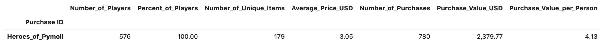
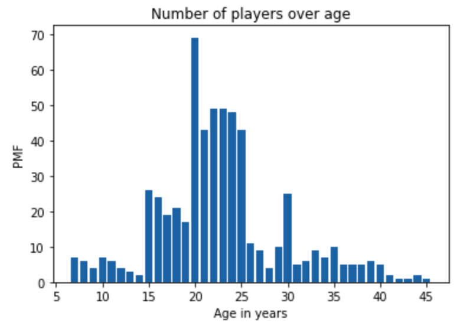
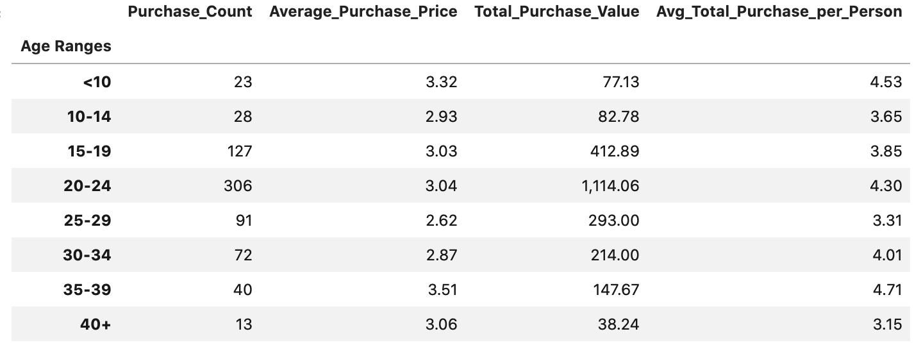
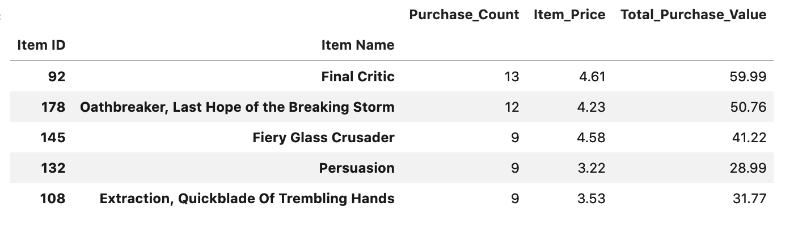

# Heroes of Pymoli Case (Pandas Challenge Homework Project)

Homework Assignment, Data Science and Visualization Boot Camp (Northwestern University)

## DataSet Description and Basic Summary Analysis

* We are asked to analyze the  the data for the most recent fantasy game Heroes of Pymoli created by a fiction game company. Exploring and summarizing results should include:
    1. Total purchasing analysis
    2. Gender Demographics and purchasing analysis by gender
    3. Age Demographics and purchasing analysis by age
    4. Top Spenders
    5. Most Popular Items
    6. Most Profitable Items

* The district summary includes 15 schools (both district and charter) with a total number of 39,170 students and a total budget of $24,649,428 ($629.29 per student). Below is the summary of the given dataset:

## DataSet Observations

#### Trend 1: Target audience 20-25 years

#### Trend 2: Most popular items

## Contacts
[Find Me on
LinkedIn](https://www.linkedin.com/in/oleg-n-ryzhkov/)
