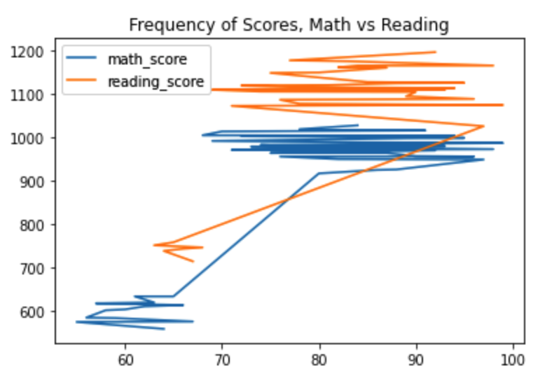

# PyCitySchools Case (Pandas Challenge Homework Project)

Homework Assignment, Data Science and Visualization Boot Camp (Northwestern University)

## Abstract

* Any country's economy tends to become more productive as the proportion of educated workers increases since they can more efficiently carry out tasks that demand basic literacy and critical thinking on the one hand, and require less guidance and management from the other hand. As a result, many countries provide funding for primary and secondary education to improve economic performance. Surely, education is an investment in human capital similar to an investment in better technologies and equipment.
* Schools have assumed a major role in judging key elements of merit among young people—namely, academic skills, hard work, self-discipline, and cooperative behavior. Schools do so mainly by evaluating students in a variety of subjects deemed important for success later in life. The two most essential tests have been remaining  the same for many years are math and reading.

## DataSet Description and Basic Summary Analysis

* We are asked to analyze the district-wide standardized test results based on every student's math and reading scores, as well as various information on the schools they attend. Revealing trends in school performance should be based on aggregation of the following data:
    1. District and school summary
    2. Top performing schools (by % overall passing both tests)
    3. Bottom performing schools (by % overall passing both tests)
    4. Math and reading scores by grade
    5. Scores by school spending
    6. Scores by school type and size
    7. Scores by gender (female vs male)

* The district summary includes 15 schools (both district and charter) with a total number of 39,170 students and a total budget of $24,649,428 ($629.29 per student). Below is the summary of the given dataset:

## Observations in Schools Performance

Expand

#### Trend 1: Overall performance in reading is better over math

#### Trend 2: Overall performance in Charter schools is better over District schools

#### Trend 3: Overall performance in small and medium size schools is better over large schools

#### Trend 4: Overall performance among female students is better over male students

## Case Conclusions

Expand

* Overall, the observed trends revealed the general tendency: students achievements in reading are better over math and charter schools students performance is better over district schools.  
* Additionally, at least two other observed trends require attention. The first is that, the overall both tests passing rate is significantly lower versus at least one test passing rate (65.17% both tests pass vs >90% at least one test). It reveals the tendency of a large number of students who passed one test and failed another one.  The second one is the overall performance is not significantly affected by the particular school spending budget per one student.
* In 1967, on the first international comparison of educational achievement in math, the United States ranked 11 out of 12 nations. Nothing serious has changed since that time. The U.S. still ranks behind the main group of developed countries. After recent tests results were released by the Programme for International Student Assessment, or PISA , US Secretary of Education Betsy DeVos said "The bottom line is there has not been a single study that shows American education is improving enough," DeVos said in a statement. "Scores have flatlined for a decade. Worse yet, scores for our most vulnerable students continue to decline. We are being outpaced not only by our global competitors like China and Russia, but also by countries like Estonia, Finland and Canada."
* And it brings us to a final conclusion. The family factor plays a significant role in student's performance. Unfortunately, the inequality in parent's wealth and status is still remaining a big barrier in obtaining a quality primary education in US. A founding ideal of American democracy is that merit, not accident of birth, should determine individuals’ income and social status demands extra attention and resources at the federal level to improve overall performance across US schools.

## Appendix: Schools Performance Summary

## Contacts
[Find Me on
LinkedIn](https://www.linkedin.com/in/oleg-n-ryzhkov/)
